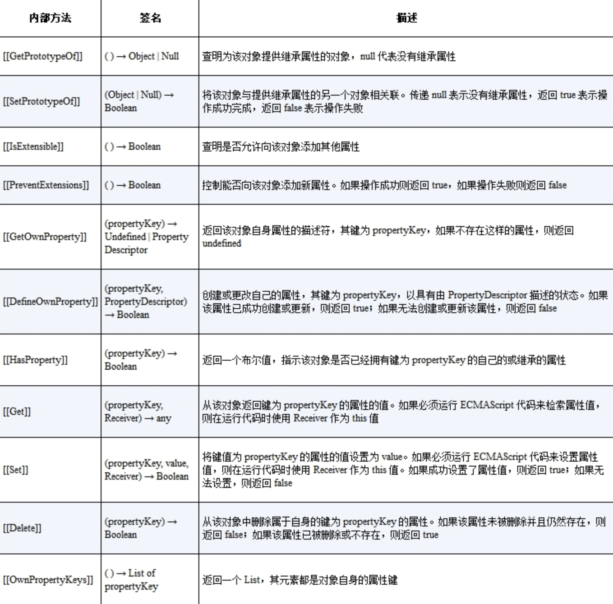

## 理解 Proxy 和 Reflect

众所周知，Vue3 中的响应式数据是基于 Proxy 实现的，那什么是 Proxy 呢？

简单地说，使用 Proxy 可以创建一个代理对象。它能够实现对**其他对象**的代理，这里的关键词是其他对象，也就是说，Proxy 只能代理对象，无法代理非对象值，例如字符串、布尔值等。


那什么是对象的代理呢？

**代理的含义：**对一个对象基本语义的代理，拦截并重新定义对一个对象的基本操作。

**基本语义的操作：**读取、设置属性值的操作，就属于基本语义的操作。

```js
const p = new Proxy(obj, {
  // 拦截读取属性操作
  get() { /*...*/ },
  // 拦截设置属性操作
  set() { /*...*/ }
})

obj.foo // 读取属性 foo 的值
obj.foo++ // 读取和设置属性 foo 的值
```

因为在 JavaScript 的世界里，万物皆对象。一个函数也是一个对象，所以调用函数也是对一个对象的基本操作，所以我们也可以用 Proxy 来拦截函数的调用操作：

```js
const fn = (name) => {
  console.log('我是：', name)
}

const p2 = new Proxy(fn, {
  // 使用 apply 拦截函数调用
  apply(target, thisArg, argArray) {
    target.call(thisArg, ...argArray)
  }
})

p2('lc') // 输出：'我是：lc'
```

**所以，Proxy 对一个对象的代理，也就是能够拦截对一个对象的基本操作。**

但是对一个对象的复合操作是无法代理的，调用对象下的方法就是典型的复合操作：

```js
obj.fn()
```

它是由两个基本语义组成的。第一个基本语义是get，即先通过 get 操作得到 obj.fn 属性。第二个基本语义是函数调用，即通过get 得到 obj.fn 的值后再调用它。


我们再来介绍一下在 Vue3 响应式数据的代理中会使用到的 **Reflect**。

Reflect 是一个全局对象，在其下面有很多方法：

```js
Reflect.get()
Reflect.set()
Reflect.apply()
// ...
```

**任何在 Proxy 的拦截器中能够找到的方法，都能够在 Reflect 中找到同名函数。**

例如下面的两个操作是等价的：

```js
const obj = { foo: 1 }

// 直接读取
console.log(obj.foo) // 1
// 使用 Reflect.get 读取
console.log(Reflect.get(obj, 'foo')) // 1
```

既然操作是等价的，那么 Vue3 中使用 Reflect 的意义是什么呢？

**实际上 Reflect.get 函数还能接收第三个参数，即指定接收者 receiver**，你可以把它理解为函数调用过程中的 this，例如：

```js
const obj = { foo: 1 }
console.log(Reflect.get(obj, 'foo', { foo: 2 }))  // 输出的是 2 而不是 1
```

Reflect 方法虽然还有很多其他方面的意义，但是在 Vue3 中唯一关心的只有这一点，因为它与响应式数据的实现密切相关。我们在使用 Proxy 进行代理的过程中，原对象和代理对象之间会出现 this 指向混乱的问题，这会导致收集依赖时出错，使用 Reflect 传递 this 可以帮助避免在响应式代理阶段产生的 this 指向问题。

下面举个例子帮助大家理解。

```js
const obj = { foo: 1 }

const p = new Proxy(obj, {
  get(target, key) {
    track(target, key) // 收集依赖
    // 注意，这里我们没有使用 Reflect.get 完成读取
    return target[key]
  },
  set(target, key, newVal) {
    // 这里同样没有使用 Reflect.set 完成设置
    target[key] = newVal
    trigger(target, key) // 分发依赖，触发相关的响应式函数的执行
  }
})
```

这是一个用来实现响应式数据的最基本的代码。

在 get 和 set 拦截函数中，我们都是直接使用原始对象 target 来完成对属性的读取和设置操作的，其中原始对象 target 就是上述代码中的 obj 对象。

接下来我们为 obj 添加一个 bar 属性：

```js
const obj = {
  foo: 1,
  get bar() {
    return this.foo
  }
}
```

bar 属性是一个访问器属性，它返回了 this.foo 属性的值。接着，我们在 effect 副作用函数中通过代理对象 p 访问 bar 属性：

```js
effect(() => {
  console.log(p.bar) // 1
})
```

我们来分析一下这个过程发生的事情。当 effect 注册的副作用函数执行时，会读取 p.bar 属性，它发现 p.bar 是一个访问器属性，因此执行 getter 函数。由于在 getter 函数中通过 this.foo 读取了 foo 属性值，因此我们认为副作用函数与属性 foo 之间也会建立联系。当我们修改 p.foo 的值时应该能够触发响应，使得副作用函数重新执行才对。

然而实际并非如此，当我们尝试修改 p.foo 的值时：

```js
p.foo++
```

副作用函数并不会重新执行，问题出在哪里呢？实际上，问题就出在 bar 属性的访问器函数 getter 里：

```js
const obj = {
  foo: 1,
  get bar() {
    // 这里的 this 指向的是谁？
    return this.foo
  }
}
```

当我们使用 this.foo 读取 foo 属性值时，这里的 this 指向的是谁呢？

我们回顾一下整个流程。首先，我们通过代理对象 p 访问 p.bar，这会触发代理对象的 get 拦截函数执行：

```js
const p = new Proxy(obj, {
  get(target, key) {
    track(target, key)
    // 注意，这里我们没有使用 Reflect.get 完成读取
    return target[key]
  },
  // 省略部分代码
})
```

在 get 拦截函数内，通过 target[key] 返回属性值。其中 target 是原始对象 obj，而 key 就是字符串 'bar'，所以 target[key] 相当于 obj.bar。因此，当我们使用p.bar 访问 bar 属性时，它的 getter 函数内的 this 指向的其实是原始对象 obj，这说明我们最终访问的其实是 obj.foo。

很显然，在副作用函数内通过原始对象访问它的某个属性是不会建立响应联系的，这等价于：

```js
effect(() => {
  // obj 是原始数据，不是代理对象，这样的访问不能够建立响应联系
  obj.foo
})
```

因为这样做不会建立响应联系，所以出现了无法触发响应的问题。那么这个问题应该如何解决呢？这时 Reflect.get 函数就派上用场了：

```js
const p = new Proxy(obj, {
  // 拦截读取操作，接收第三个参数 receiver
  get(target, key, receiver) {
    track(target, key)
    // 使用 Reflect.get 返回读取到的属性值
    return Reflect.get(target, key, receiver)
  },
  // 省略部分代码
})
```

代理对象的 get 拦截函数接收第三个参数 receiver，它代表谁在读取属性，例如：

```js
p.bar // 代理对象 p 在读取 bar 属性
```

当我们使用代理对象 p 访问 bar 属性时，那么 receiver 就是 p，可以把它简单地理解为函数调用中的 this。接着关键的一步发生了，我们使用 `Reflect.get(target, key, receiver)` 代替之前的 `target[key]`，这里的关键点就是第三个参数 receiver。我们已经知道它就是代理对象 p，所以访问器属性 bar 的 getter 函数内的 this 指向代理对象 p。

很显然，这样的 this 指向才会在副作用函数与响应式数据之间建立响应联系，从而达到依赖收集的效果。如果此时再对 p.foo 进行自增操作，会发现已经能够触发副作用函数重新执行了。

正是基于上述原因，Vue3 中统一使用了 Reflect.* 方法来进行对象的各类操作。


## JavaScript 对象及 Proxy 的工作原理

在 JavaScript 中有两种对象，其中一种叫作常规对象（ordinary object），另一种叫作异质对象（exotic object）。这两种对象包含了 JavaScript 世界中的所有对象，任何不属于常规对象的对象都是异质对象。


我们可以通过对象的**内部方法/内部槽**来区分这两者。

所谓内部方法，指的是当我们对一个对象进行操作时在引擎内部调用的方法，这些方法对于JavaScript 使用者来说是不可见的。

举个例子，当我们访问对象属性时：

```js
obj.foo
```

引擎内部会调用 [[Get]] 这个内部方法来读取属性值。

> 补充说明：在 ECMAScript 规范中使用 [[xxx]] 来代表内部方法或内部槽。
>
> 如何区分一个对象是普通对象还是函数呢？一个对象在什么情况下才能作为函数调用呢？答案是，通过内部方法和内部槽来区分对象，例如函数对象会部署内部方法 [[Call]]，而普通对象则不会。


内部方法具有多态性。

不同类型的对象可能部署了相同的内部方法，却具有不同的逻辑。

例如，普通对象和 Proxy 对象都部署了 [[Get]]这个内部方法，但它们的逻辑是不同的，普通对象部署的 [[Get]] 内部方法的逻辑是由 ECMA 规范的10.1.8 节定义的，而 Proxy 对象部署的 [[Get]] 内部方法的逻辑是由 ECMA 规范的 10.5.8 节来定义的。对象必要的内部方法如下表：



所以，常规对象和异质对象的区别如下，满足以下三点要求的对象就是常规对象：

- 对于上表中列出的内部方法，必须使用 ECMA 规范 10.1.x 节给出的定义实现
- 对于额外的内部方法 [[Call]]，必须使用 ECMA 规范 10.2.1 节给出的定义实现
- 对于额外的内部方法 [[Construct]]，必须使用 ECMA 规范 10.2.2 节给出的定义实现

而所有不符合这三点要求的对象都是异质对象。例如，由于 Proxy 对象的内部方法 [[Get]] 没有使用ECMA 规范的 10.1.8 节给出的定义实现，所以 Proxy 是一个异质对象。


如果在创建 Proxy 代理对象时没有指定对应的拦截函数，例如没有指定 get() 拦截函数，那么当我们通过 Proxy 代理对象访问属性值时，代理对象的内部方法 [[Get]] 会调用原始对象的内部方法 [[Get]] 来获取属性值。

由此我们可以知道，创建 Proxy 代理对象时指定的拦截函数，实际上是用来自定义 Proxy 代理对象**本身**的内部方法和行为的，而不是用来指定被代理对象的内部方法和行为的。


举个例子，当我们要拦截删除属性操作时，可以使用 deleteProperty 拦截函数（delete操作符的捕捉器）实现：

```js
const obj = { foo: 1 }
const p = new Proxy(obj, {
  deleteProperty(target, key) {
    return Reflect.deleteProperty(target, key)
  }
})

console.log(p.foo) // 1
delete p.foo
console.log(p.foo) // 未定义
```

根据上述所知，这里 deleteProperty 实现的是代理对象 p 的内部方法和行为（而不是 obj），所以为了删除被代理对象 obj 上的属性值，我们需要使用 Reflect.deleteProperty(target, key) 来完成（所以这里不需要通过第三个参数将 this 指向 p）。


## 如何代理 Object

从本节开始，我们将着手实现响应式数据。


响应式系统应该拦截**一切**读取操作，以便当数据变化时能够正确地触发响应。但是“读取”是一个很宽泛的概念，例如使用 in 操作符检查对象上是否具有给定的 key 也属于“读取”操作。

我们列举一下对一个普通对象的所有可能的读取操作：

1. 访问属性：obj.foo
2. 判断对象或原型上是否存在给定的 key：key in obj
3. 使用 for...in 循环遍历对象：for (const key in obj) {}


#### obj.foo

对于属性的读取，例如 obj.foo，我们可以直接通过 get 拦截函数实现：

```js
const obj = { foo: 1 }
const p = new Proxy(obj, {
  get(target, key, receiver) {
    // 建立联系
    track(target, key)
    // 返回属性值
    return Reflect.get(target, key, receiver)
  }
})
```


#### key in obj

而对于 in 操作符呢？通过查找  ECMA-262 规范，我们最终知道 in 操作符的运算结果是通过调用一个叫作 `HasProperty` 的抽象方法得到的，它对应的拦截函数名叫 has，因此我们可以通过 has 拦截函数实现对 in 操作符的代理：

```js
const obj = { foo: 1 }
const p = new Proxy(obj, {
  has(target, key) {
    track(target, key)
    return Reflect.has(target, key)
  }
})
```

这样，当我们在副作用函数中通过 in 操作符操作响应式数据时，就能够建立依赖关系：

```js
effect(() => {
  'foo' in p // 将会建立依赖关系
})
```


#### for (const key in obj) {}

再看看 for..in 循环，通过查找  ECMA-262 规范，我们再次得知可以使用 `ownKeys` 拦截函数来间接拦截 for...in 循环：

```js
const obj = { foo: 1 }
const ITERATE_KEY = Symbol()

const p = new Proxy(obj, {
  ownKeys(target) {
    // 将副作用函数与 ITERATE_KEY 关联
    track(target, ITERATE_KEY)
    return Reflect.ownKeys(target)
  }
})

// 副作用函数
effect(() => {
  // for...in 循环
  for (const key in p) {
    console.log(key) // foo
  }
})
```

但是，这个拦截函数和 get 不一样，它无法获取 key 值。

上述代码中，副作用函数中总共进行了一次 for...in 循环，那么 ownKeys 总共会拦截一次，并且得到的这个 target 就是 `{ foo: 1 }` （有多少次 for..in 循环 ownKeys 就会拦截多少次，并不是 obj 中的每个 key 都拦截一次）。ownKeys 这个函数是用来**获取一个对象上所有属于自己的键值**，这个操作是**不与任何具体的键进行绑定**的，也就是说每个 for...in 循环我们都需要一个 key 来绑定它。

因此 **Vue3 中手动构造了唯一的 key 作为标识，即上述代码中声明的 ITERATE_KEY**。


随之而言，既然追踪的是 ITERATE_KEY，那么相应地，在触发响应的时候也应该触发它才行：

```js
trigger(target, ITERATE_KEY)
```

但是在什么场景下，对数据的操作需要触发与 ITERATE_KEY 相关联的副作用函数重新执行呢？

场景如下：

- 对象添加了新的属性（修改属性时并不需要触发）
- 对象删除了属性

例如一个对象 `{ foo: 1 }`，由于其原本只有 foo 属性，因此 for...in 循环只会执行一次。现在我们为它添加一个新的属性 bar，for...in 循环就会由执行一次变成执行两次。也就是说，当为对象添加新属性时，会对 for...in 循环产生影响，所以需要触发与 ITERATE_KEY 相关联的副作用函数重新执行。同理，删除对象上的属性时，也需要触发。


依上所述，对 for...in 读取和设置操作的拦截与通常的 get/set 拦截不同，需要注意实现以下几点：

- 当为对象 p 添加新的属性 bar 时，不仅需要触发与原先已有属性 key （**通过 obj.key 访问时绑定的副作用函数**）相关联的副作用函数，还需要触发与 ITERATE_KEY 相关联的副作用函数。
- 当修改已有属性的值时，不会对 for...in 循环产生影响，因为无论怎么修改一个属性的值，对于for...in 循环来说都只会循环一次。所以在这种情况下，我们不需要触发副作用函数重新执行，否则会造成不必要的性能开销。所以就需要我们在 set 拦截函数内能够区分操作的类型，到底是添加新属性还是设置已有属性。
- 当删除属性时，会使得对象的键变少，它会影响 for...in 循环的次数，此时我们也应该触发那些与 ITERATE_KEY 相关联的副作用函数重新执行。
- 当删除属性时，需要首先检查被删除的属性是否属于对象自身（而不是原型上的），然后调用 Reflect.deleteProperty 函数完成属性的删除工作。当这两步的结果都满足条件时，才触发副作用函数的重新执行。


先看下通常对对象设置的操作拦截是如何写的：

```js
const p = new Proxy(obj, {
  // 拦截设置操作
  set(target, key, newVal, receiver) {
    // 设置属性值
    const res = Reflect.set(target, key, newVal, receiver)
    // 把副作用函数从桶里取出并执行
    trigger(target, key)
    return res
  },
  // 省略其他拦截函数
})
```


再看对 for...in 操作的拦截详细实现如下：

```js
const p = new Proxy(obj, {
  // 拦截设置操作（因为对obj某个属性的修改或者添加都是通过set拦截的，而删除是通过deleteProperty拦截的）
  set(target, key, newVal, receiver) {
    // 如果属性不存在，则说明是在添加新属性，否则是设置已有属性
    const type = Object.prototype.hasOwnProperty.call(target, key) ? 'SET' : 'ADD'

    // 设置属性值
    const res = Reflect.set(target, key, newVal, receiver)
    // 将 type 作为第三个参数传递给 trigger 函数
    trigger(target, key, type)

    return res
  },
  // 省略其他拦截函数
})
```

如以上代码所示，我们优先使用 Object.prototype.hasOwnProperty 检查当前操作的属性是否已经存在于目标对象上，如果存在，则说明当前操作类型为 'SET'，即修改属性值；否则认为当前操作类型为 'ADD'，即添加新属性。最后，我们把类型结果 type 作为第三个参数传递给 trigger 函数。

```js
const p = new Proxy(obj, {
  deleteProperty(target, key) {
    // 检查被操作的属性是否是对象自己的属性
    const hadKey = Object.prototype.hasOwnProperty.call(target, key)
    // 使用 Reflect.deleteProperty 完成属性的删除
    const res = Reflect.deleteProperty(target, key)

    if (res && hadKey) {
      // 只有当被删除的属性是对象自己的属性并且成功删除时，才触发更新
      trigger(target, key, 'DELETE')
    }

    return res
  }
})
```

同样的，对 delete 的操作也需要进行拦截。

接下来在 trigger 函数内就可以通过类型 type 来区分当前的操作类型，并且只有当操作类型 type 为 'ADD' 或 'DELETE' 时，才会触发与 ITERATE_KEY 相关联的副作用函数重新执行，这样就避免了不必要的性能损耗：

```js
function trigger(target, key, type) {
  const depsMap = bucket.get(target)
  if (!depsMap) return
  const effects = depsMap.get(key)

  const effectsToRun = new Set()
  effects && effects.forEach(effectFn => {
    if (effectFn !== activeEffect) {
      effectsToRun.add(effectFn)
    }
  })

  console.log(type, key)
  // 只有当操作类型为 'ADD' 或 'DELETE' 时，才需要触发与 ITERATE_KEY 相关联的副作用函数重新执行
  if (type === 'ADD' || type === 'DELETE') {
    const iterateEffects = depsMap.get(ITERATE_KEY)
    iterateEffects && iterateEffects.forEach(effectFn => {
      if (effectFn !== activeEffect) {
        effectsToRun.add(effectFn)
      }
    })
  }

  effectsToRun.forEach(effectFn => {
    if (effectFn.options.scheduler) {
      effectFn.options.scheduler(effectFn)
    } else {
      effectFn()
    }
  })
}
```


## 浅响应与深响应

在 Vue3 中，我们不仅可以进行深响应式的监听，还能进行浅响应式的监听。reactive 是深响应，shallowReactive 是浅响应。

例如，我们代理一个多层级的对象：

```js
const obj = {
  foo: {
    bar: 1
  }
}
```

该对象的 foo 属性也是一个对象 `{ bar: 1 }`，我们先看一下像上述章节那样简单的监听会是什么效果：

```js
function reactive(obj) {
  return new Proxy(obj, {
    get(target, key, receiver) {
      track(target, key)
      // 当读取属性值时，直接返回结果
      return Reflect.get(target, key, receiver)
    }
    // 省略其他拦截函数
  })
}
```

由上述代码可知，我们用 get 进行拦截 obj 时，首先会读取 obj.foo 的值，这里我们直接使用 Reflect.get 函数返回 obj.foo 的结果，这样得到的 obj.foo 就只是一个普通对象，他并不是一个响应式对象，所以当我们在副作用函数中访问 obj.foo.bar 时，是无法建立响应联系的。

所以我们需要对 Reflect.get 返回的结果再做一层包装：

```js
function reactive(obj) {
  return new Proxy(obj, {
    get(target, key, receiver) {
      track(target, key)
      // 得到原始值结果
      const res = Reflect.get(target, key, receiver)
      if (typeof res === 'object' && res !== null) {
        // 调用 reactive 将结果包装成响应式数据并返回
        return reactive(res)
      }
      // 返回 res
      return res
    }
    // 省略其他拦截函数
  })
}
```

上述代码就是一个深响应，也就是 reactive 的实现原理。

如上所示，当读取属性值时，我们首先检测该值是否是对象，如果是对象，则递归地调用 reactive 函数将其包装成响应式数据并返回。这样当使用 obj.foo 读取 foo 属性值时，得到的就会是一个响应式数据。当修改obj.foo.bar 的值时，就能够触发副作用函数的重新执行了。


但是，考虑到并不是所有情况我们都希望是深响应的，于是 Vue3 中就促生了另一个叫 **shallowReactive** 的函数来进行**浅响应**的监听。

> 所谓浅响应，指的是只有对象的**第一层属性**是响应式的。

为此，Vue3 中统一使用了一个 createReactive 函数来执行响应式的监听：

```js
function reactive(obj) {
  return createReactive(obj)
}
function shallowReactive(obj) {
  return createReactive(obj, true)
}
```

```js
// 封装 createReactive 函数，接收一个参数 isShallow，代表是否为浅响应，默认为 false，即非浅响应
function createReactive(obj, isShallow = false) {
  return new Proxy(obj, {
    // 拦截读取操作
    get(target, key, receiver) {
      const res = Reflect.get(target, key, receiver)

      track(target, key)
      // 如果是浅响应，则直接返回原始值
      if (isShallow) {
        return res
      }

      if (typeof res === 'object' && res !== null) {
        return reactive(res)
      }

       return res
    }
     // 省略其他拦截函数
  })
}
```


## 只读和浅只读

Vue 开发中，我们会希望一些数据是只读的，例如组件接收到的 props 对象，当用户尝试修改只读数据时，会收到一条警告信息，这样就实现了对数据的保护。这时就要用到接下来要讨论的 readonly 函数，它能够将一个数据变成只读的：

```js
const obj = readonly({ foo: 1 })
// 尝试修改数据，会得到警告
obj.foo = 2
```

当一个数据是只读的，我们需要实现以下几点：

- 不可以通过 set 拦截设置对象的属性值
- 不可以通过 deleteProperty 拦截删除对象的属性
- 不用建立响应式联系（如果一个数据是只读的，那就意味着任何方式都无法修改它）
- 只读也分为深只读和浅只读

Vue3 基于以上几点实现了对只读数据的代理，只读数据本质上也是对数据对象的代理，所以同样可以使用 createReactive 函数来实现。如下面的代码所示，我们为 createReactive 函数增加第三个参数 isReadonly：

```js
function readonly(obj) {
  return createReactive(obj, false, true)
}

function shallowReadonly(obj) {
  return createReactive(obj, true /* shallow */, true)
}
```

这样，我们在 shallowReadonly 函数内调用 createReactive 函数创建代理对象时，将第二个参数 isShallow 设置为 true，这样就可以创建一个浅只读的代理对象了。

具体实现如下：

```js
// 增加第三个参数 isReadonly，代表是否只读，默认为false，即非只读
function createReactive(obj, isShallow = false, isReadonly = false) {
  return new Proxy(obj, {
    // 拦截读取操作
    get(target, key, receiver) {
      // 如果一个数据是只读的，则不用建立响应式联系
      if (!isReadonly) {
        track(target, key)
      }

      const res = Reflect.get(target, key, receiver)

      if (isShallow) {
        return res
      }

      if (typeof res === 'object' && res !== null) {
        // 如果数据为只读，则调用 readonly 对值进行包装
        return isReadonly ? readonly(res) : reactive(res)
      }

      return res
    },
    set(target, key, newVal, receiver) {
      // 如果是只读的，则打印警告信息并返回
      if (isReadonly) {
        console.warn(`属性 ${key} 是只读的`)
        return true
      }
      const oldVal = target[key]
      const type = Object.prototype.hasOwnProperty.call(target, key) ? 'SET' : 'ADD'
      const res = Reflect.set(target, key, newVal, receiver)
      if (target === receiver.raw) {
        if (oldVal !== newVal && (oldVal === oldVal || newVal === newVal)) {
          trigger(target, key, type)
        }
      }

      return res
    },
    deleteProperty(target, key) {
      // 如果是只读的，则打印警告信息并返回
      if (isReadonly) {
        console.warn(`属性 ${key} 是只读的`)
        return true
      }
      const hadKey = Object.prototype.hasOwnProperty.call(target, key)
      const res = Reflect.deleteProperty(target, key)

      if (res && hadKey) {
        trigger(target, key, 'DELETE')
      }

      return res
    }
     // 省略其他拦截函数
  })
}
```


