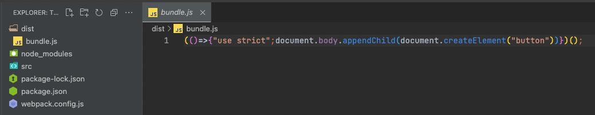
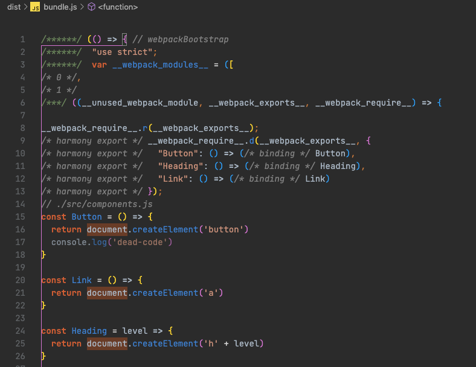
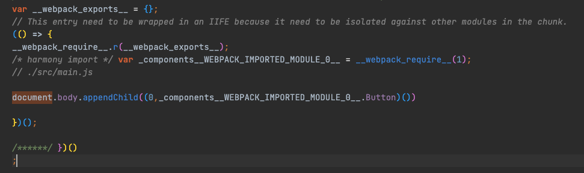
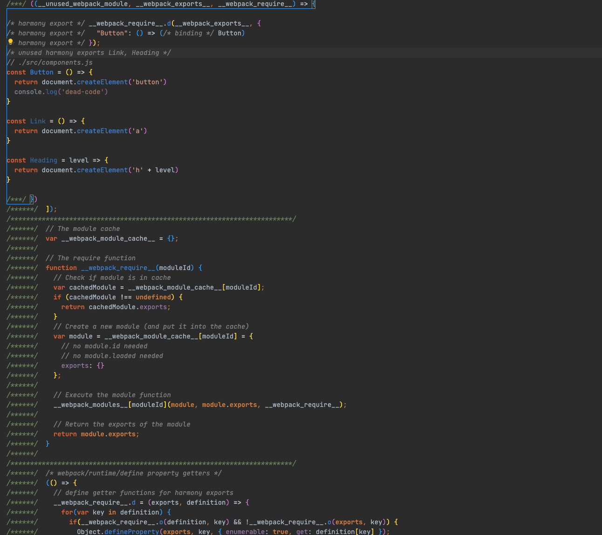
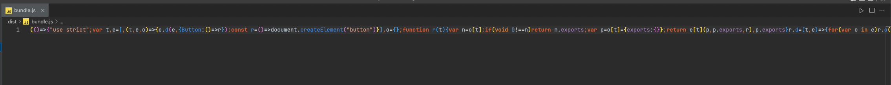
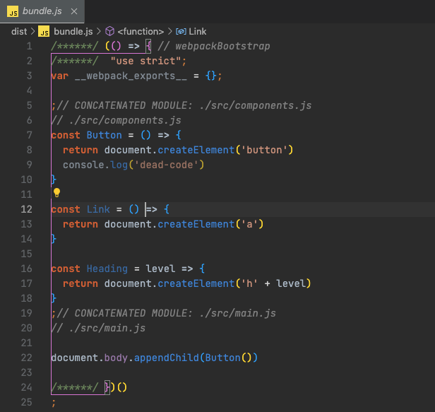
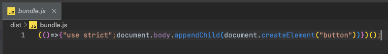
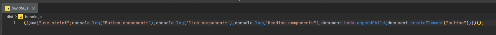

Webpack 打包优化并没有固定的几个模式，一般常见的优化就是拆包、分块、压缩等，但并不是对每一个项目都适用，针对于特定项目，我们需要根据项目实际的情况，不断的调试不断的优化，找到最适合的方式。

今天主要介绍用来优化 Webpack 打包的两个高级特性：Tree Shaking 和 sideEffects

## Tree shaking

### 概念

Tree shaking 在中文里是 “摇树” 的意思，如果将整个项目比作一棵参天大树，摇树就是将这颗树上的一些枯树叶树枝给摇下来，这些枯树枝，就是项目里的 dead-code(未引用的代码)，Tree shaking 的作用就是用来移除这些 dead-code。

另外，Tree-shaking 并不是指 Webpack 中的某一个配置选项，而是一组功能搭配使用过后实现的效果，这组功能**在生产模式下都会自动启用**，所以使用生产模式打包就会有 Tree-shaking 的效果。

Tree-shaking 最早是 [Rollup](https://github.com/rollup/rollup) 中推出的一个特性，Webpack 从 2.0 过后也开始支持这个特性。

先来看一个例子：

```
   ├── src
   │   ├── components.js
   │   └── main.js
   ├── package.json
   └── webpack.config.js
```

```js
// ./src/components.js

export const Button = () => {
  return document.createElement('button')
  console.log('dead-code')
}

export const Link = () => {
  return document.createElement('a')
}

export const Heading = level => {
  return document.createElement('h' + level)
}
```

可以看到上面的 `console.log` 是在 `return` 之后的，所以这句代码是永远都不会被执行的。这个时候的 `console.log` 就属于 dead-code。

在 main.js 文件中导入 compnents.js：

```js
// ./src/main.js
import { Button } from './components'
document.body.appendChild(Button())
```

这里，我们只提取了模块中的 Button 成员，这就意味着 Link 和 Heading 成员并不会被用到，那它们两个函数的相关代码就也属于冗余代码。

我们需要去除冗余的代码，这是生产环境优化中一个很重要的工作。Webpack 的 Tree-shaking 功能就很好地实现了这一点。

当我们使用 production 模式运行打包时，就可以开启 Tree shaking 功能：

```sh
$ npx webpack --mode=production
```

最终打包后的文件如图



可以看到，打包完成后的 bundle.js 文件中，我们上述提到的冗余代码（即dead-code）就并不会输出，这就是经过 Tree shaking 处理之后的效果。


### 开启方式

开启 Tree shaking 的方式主要有如下几种：

- 生产模式下会自动打开
- 其他模式
  - usedExports
  - minimize


如我们上文所说，生产模式下可自动开启 Tree shaking，接下来介绍一下在其他模式下如何开启 Tree shaking。

我们来再次运行一遍 Webpack 打包，不过这一次我们不再使用 production 模式，而是使用 none，也就是不开启任何内置功能和插件，具体命令如下：

```sh
$ npx webpack --mode=none
```

打包过后的 bundle.js 文件如下

components.js 对应模块



main.js 对应模块



可以看到，源代码中的一个模块就对应这里的一个函数，这里 components 对应的这个模块，虽然外部没有使用这里的 Link 函数和 Heading 函数，但是仍然导出了它们。


接下来我们打开 Webpack 的配置文件，在配置对象中添加一个 `optimization` 属性，这个属性是用来集中配置 Webpack 内置优化功能的，它的值也是一个对象。

在 optimization 配置中我们开启一个 `usedExports` 选项。这个配置项表示**在输出结果中只导出外部使用了的成员**，具体配置如下：

```js
// ./webpack.config.js
module.exports = {
  // ... 其他配置项
  optimization: {
    // 模块只导出被使用的成员
    usedExports: true
  }
}
```

配置完成后我们再重新进行打包，再来看一下输出的 bundle.js：



虽然 bundle.js 文件中还会出现 Link 和 Heading 这两个函数，但他们不再被导出了，没有任何地方依赖这些代码（vscode中代码颜色变淡，表示未被引用），那它们对应的代码就变成了 **未引用代码**。


对于这种未引用代码，如果我们开启**压缩代码功能**，就可以自动压缩掉这些没有用到的代码。

我们再在配置文件中开启 minimize，具体配置如下：

```js
// ./webpack.config.js
module.exports = {
  // ... 其他配置项
  optimization: {
    // 模块只导出被使用的成员
    usedExports: true,
    // 压缩输出结果
    minimize: true
  }
}
```

然后重新进行打包，结果如下：



可以发现，Link 和 Heading 这些未引用代码就都被自动移除了。

所以，如果把我们的代码看成一棵树，那么以上这两个配置的功能就是

- usedExports 的作用就是标记树上哪些是枯树枝和枯树叶
- minimize 的作用就是负责把枯树枝、枯树叶摇下来

我们在其他模式下就可以通过这两个配置结合，来开启 Tree shaking。


### 合并模块

除了上述两种配置外，我们还可以使用一个 concatenateModules 配置继续优化输出。

concatenateModules 配置的作用是**尽可能将所有模块合并到一起输出到一个函数中**，这样做就既提升了运行效率，又减少了代码的体积。

> 普通的打包只是将一个模块最终放入一个单独的函数中，如果我们的模块很多，就意味着在输出结果中会有很多的模块函数。


接下来我们在配置文件中的 optimization 属性下开启 concatenateModules。具体配置如下：

```js
// ./webpack.config.js
module.exports = {
  // ... 其他配置项
  optimization: {
    // 模块只导出被使用的成员
    usedExports: true,
    // 尽可能合并每一个模块到一个函数中
    concatenateModules: true
  }
}
```

打包结果如图所示：




如果我们同时再将 minimize 置为 true，打包结果的体积又会减小很多：




### babel-loader 问题

有的时候我们会发现这样一个问题：当为 JS 模块配置 babel-loader 时，会导致 Tree-shaking 失效。

这里我们需要明确一点：**Tree-shaking 实现的前提是 ES Modules**，也就是说：最终**交给 Webpack 打包的代码，必须是使用 ES Modules 的方式来组织的模块化**。

为什么这么说呢？

因为 Webpack 在打包所有的模块代码之前，先是将模块根据配置交给不同的 Loader 处理，最后再将 Loader 处理的结果打包到一起。

很多时候，我们为了更好的兼容性，会选择使用 [babel-loader](https://github.com/babel/babel-loader) 去转换我们源代码中的一些 ECMAScript 的新特性。而 Babel 在转换 JS 代码时，很有可能就会处理掉我们代码中的 ES Modules 部分，将 ES Modules 转换成了 CommonJS 的方式。

而 Babel 具体会不会处理 ES Modules 代码，取决于我们有没有为它配置使用转换 ES Modules 的插件。很多时候，我们为 Babel 配置的都是一个 preset（预设插件集合），而不是某些具体的插件。例如，我们在项目中使用最多的 [@babel/preset-env](https://babeljs.io/docs/en/babel-preset-env)，这个预设里面就有[转换 ES Modules 的插件](https://babeljs.io/docs/en/babel-plugin-transform-modules-commonjs)。所以当我们使用这个预设时，代码中的 ES Modules 部分就会被转换成 CommonJS 方式。那 Webpack 再去打包时，拿到的就是以 CommonJS 方式组织的代码了，所以 Tree-shaking 不能生效。

但是在最新版本（8.x）的 babel-loader 中，已经自动帮我们关闭了对 ES Modules 转换的插件，感兴趣的可以参考对应版本 babel-loader 的[源码](https://github.com/babel/babel-loader/blob/v8.1.0/src/injectCaller.js)，核心代码如下：

```js
// Webpack >= 2 supports ESM and dynamic import.
supportsStaticESM: true,
supportsDynamicImport: true
```

这里标识了当前环境支持 ES Modules，然后在 [@babal/preset-env](https://github.com/babel/babel-preset-env) 模块的源码中，会根据这两个环境标识来自动禁用对 ES Modules 的转换插件，所以**经过 babel-loader 处理后的代码默认仍然是 ES Modules，那 Webpack 最终打包得到的还是 ES Modules 代码，Tree-shaking 自然也就可以正常工作了**。


我们也可以在 babel-loader 的配置中强制开启 ES Modules 转换成 commonJS 插件：

```js
module: {
  rules: [
    {
      test: /\.js$/,
      use: {
        loader: 'babel-loader',
        options: {
          presets: [
            ['@babel/preset-env', { modules: 'commonjs' }] // 这里的 commonjs 则是强制开启，默认这个属性是 auto
          ]
        }
      }
    }
  ]
}
```


## sideEffects

sideEffects 是 Webpack 4 中新增的特性，它允许我们通过配置**标识我们的代码是否有副作用**，从而提供更大的压缩空间。

> 模块的副作用指的是模块执行的时候除了导出成员，是否还做了其他的事情。
>


基于上文的案例将 components.js 文件中的函数拆成多个组件文件，再在 `src/components/index.js` 中将这些组件文件集中导出，结构如下：

```
├── src
│   ├── components
│   │   ├── button.js
│   │   ├── heading.js
│   │   ├── index.js
│   │   └── link.js
│   └── main.js
├── package.json
└── webpack.config.js
```

```js
// ./src/components/index.js
export { default as Button } from './button'
export { default as Link } from './link'
export { default as Heading } from './heading'
```

我们在每个组件中，都添加一个 console 操作（副作用代码），具体代码如下：

```js
// ./src/components/button.js
console.log('Button component') // 副作用代码

export default () => {
  return document.createElement('button')
}
```

我们再到打包入口文件（main.js）中去载入 components 中的 Button 成员，具体代码如下：

```js
// ./src/main.js
import { Button } from './components'

document.body.appendChild(Button())
```


根据代码我们希望的是载入 Button 模块，但这时我们执行打包，实际上载入的是 components/index.js，而 index.js 中又载入了这个目录中全部的组件模块，这就会**导致所有组件模块都会被加载执行**。

配置如下：

```js
// ./webpack.config.js
module.exports = {
  // ... 其他配置项
  optimization: {
    // 模块只导出被使用的成员
    usedExports: true,
    // 压缩输出结果
    minimize: true,
    // 尽可能合并每一个模块到一个函数中
    concatenateModules: true
  }
}
```

打包结果如下：



从打包结果可以看到，所有的组件模块都被打包进了 bundle.js，即使我们开启 Tree-shaking 特性，这些模块也**不会完全被移除**。

因为我们在其中添加了 `console` 的代码，这段代码具有副作用，但我们的实际情况中这些模块内的副作用代码都是为这个模块服务的，例如我们这里添加的 `console` 只是希望表示一下当前这个模块被加载了。但是最终整个模块都没用到，所以我们其实没必要留下这些副作用代码。但是这些副作用代码却会被打包进 bundle.js，与我们的意愿不相符。


所以，这里的结论是，**Tree-shaking 只能移除没有用到的代码成员，而想要完整移除没有用到的模块，那就需要开启 sideEffects 特性了**。


我们在配置文件中的 optimization 中开启 sideEffects 特性，具体配置如下：

```js
// ./webpack.config.js
module.exports = {
  entry: './src/main.js',
  output: {
    filename: 'bundle.js'
  },
  optimization: {
    sideEffects: true
  }
}
```

> sideEffects 这个特性在 production 模式下同样会自动开启。

在开启了 sideEffects 之后，Webpack 在打包某个模块之前就会先检查这个模块所属的 package.json 中的 sideEffects 标识，以此来判断这个模块是否有副作用，如果没有副作用的话，这些没用到的模块就不再被打包。所以，当我们这些没有用到的模块中存在一些副作用代码时，我们也可以通过 package.json 中的 sideEffects 去强制声明没有副作用。


sideEffects 配置开启之后，我们需要在 package.json 中去声明是否有副作用：

```json
{
  "name": "sideeffects",
  "version": "1.0.0",
  "description": "",
  "main": "main.js",
  "scripts": {
    "test": "echo \"Error: no test specified\" && exit 1"
  },
  "keywords": [],
  "author": "",
  "license": "ISC",
  "devDependencies": {
    "webpack": "^5.74.0",
    "webpack-cli": "^4.10.0"
  },
  "sideEffects": false
}
```

这里我们直接 `"sideEffects": false` 表示项目中所有代码都没有副作用，这样 Webpack 打包时就会完全的忽略副作用代码来进行打包，如果我们需要仅忽略部分文件的副作用的话，则需要这样配置：

```json
"sideEffects": [
  "./src/components/extend.js",
  "*.css"
]
```

这时我们那些没有用到的模块就彻底不会被打包进来了，这就是 sideEffects 的作用。


总结一下，sideEffects需要设置两个地方：

- webpack.config.js 中的 sideEffects 用来开启这个功能
- package.json 中的 sideEffects 用来标识我们的哪些代码没有副作用

> 目前很多第三方的库或者框架都已经使用了 sideEffects 标识，所以我们不会再为了一个小功能而引入一个很大体积的库了。例如，某个 UI 组件库中只有一两个组件会用到，但只要它支持 sideEffects，就可以放心的直接用了。


需要注意的是，使用 sideEffects 这个功能的前提是确定你的代码没有副作用（即副作用代码没有全局影响），否则打包时就会误删掉你那些有意义的副作用代码。


## 总结

本篇文章介绍了两个 Webpack 中的高级特性，分别是 Tree-shaking 和 sideEffects。

Tree-shaking 是一种 Webpack 内部优化打包结果后的效果，我们可以通过相关的配置来开启它。

sideEffects 的话则需要我们人为的判断哪些副作用代码是可以随着模块的移除而移除，哪些又是不可以移除的。通常是对全局有影响的副作用代码不能移除，而如果是只是对模块有影响的副作用代码就可以移除。

> 当我们对 sideEffects 特性有了一定的了解之后，就应该意识到：尽可能不要写影响全局的副作用代码。


总而言之，不管是 Tree-shaking 还是 sideEffects，它们都是为了弥补 JavaScript 早期在模块系统设计上的不足。随着 Webpack 这类技术的发展，JavaScript 的模块化已经越来越好用，缺失的功能也得到了弥补，模块化设计也越来越合理。
